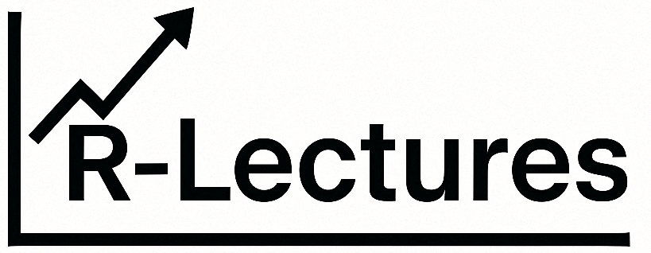

# R-Lectures Repository 

**R-Lectures** is a repository of collection of teaching material I use during my teaching at the University of Bayreuth.

If you are a beginner in R, you should start from the first lecture and go through the material in order. In case you are here to find a specific topic, you can check the table of contents below and jump to the topic you are interested in. Depending on the course I teach, there are minor differences in the content for each lecture, but the overall structure is the same.

## Lecture 1 - Getting Started
This lecture is an introduction to R, statistics, and object-oriented programming. You will find the slides for the lecture and the R script. My recommendation is to always have the native programming language in your own system, but you can also just use [**Google Colab**](https://colab.research.google.com) or any other online platform that allows you to run R code. This is what I do in the *Data Science in Economic History* courses.

[Slides](./lecture-1/lecture-1.pdf) /
[Script](./lecture-1/lecture-1.R)

## Lecture 2 - Basic Programming and Statistics
We continue where we left off by taking a closer look at vectors, dataframes, and core concepts in R.

[Slides](./lecture-2/lecture-2.pdf) /
[Script](./lecture-2/lecture-2.R)

## Lecture 3 - Probability and Statistical Calculations
After learning about the data structure and basic syntax in R, we can now talk about probability.

[Slides](./lecture-3/lecture-3.pdf) /
[Script](./lecture-3/lecture-3.R)

## Lecture 4 - ggplot2 and sf
In this lecture, we will learn about the **ggplot2** package and how to visualize data. We will also learn about the **sf** package and how to work with spatial data.

[Slides](./lecture-4/lecture-4.pdf) /
[Script](./lecture-4/lecture-4.R)

## References
I would recommend that you check out the following resources, as I prepared my material based mostly on them. Any other resource will also give you very similar content if you prefer going your own way. For some data that you would like to play around with, check out [**Kaggle**](https://www.kaggle.com/) or [**UCI Machine Learning Repository**](https://archive.ics.uci.edu/ml/index.php).

- [**Moderndive**](https://moderndive.com/index.html)
- [**RStudio Education**](https://education.rstudio.com/learn/)
- [**R for Data Science**](https://r4ds.hadley.nz/)
- [**Modern Statistics with R**](https://www.modernstatisticswithr.com/)
- [**Introduction to Econometrics with R**](https://www.econometrics-with-r.org/)
- [**Introduction to Statistical Learning**](https://www.statlearning.com)
- [**sf Documentation**](https://r-spatial.github.io/sf/index.html)
- [**Spatial Data Science**](https://r-spatial.org/book/01-hello.html)

Some GitHub repositories I used to collect examples;

- [**DogaBilimleriR**](https://github.com/ismailbekar/DogaBilimleriR)
- [**Hands-On ML**](https://github.com/ageron/handson-ml3)
